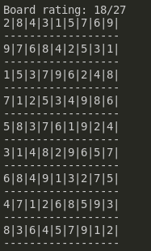

# Question 1
## Question 1.1
the 8-puzzle problem can be seen as a seach problem because you can represent each state of the board as a node in a graph, you can then make each possible move an edge in the graph.
you can then start at any given node and search the graph for the desired state, in the case of this problem it would be the solution state.
once you have reached your solution state your answer can be represented by travsering back up throught the parents, each of which will show you what move was made
the graph you would use will be a tree and you will have your initial state as the root of the tree

## Question 1.2
1. A* is an algorith that can be used to search a graph where you will start on your initial state and you will evaluate each of the child nodes, you evauluate by calculating the distance of that node from your goal node and the distance of that node from your initial state, you then add the best evaluated node to your search space and then you go through all the nodes in your search space and evaluate each child again, and add the best one to the search space, you keep doing this until you have found your goal state at which point you will have an optimal path to your goal state

2. one addmissable heuristic function that you could use is the total euclidean distance for each tile from its desired location, this is addmissable because you know that it will always take an amount of moves that is more than or equal to the euclidean distance to get the tile to the locaion because you cannot move tiles diagnoally.\
another addmissable heuristic function that could be used is the total manhattan distance from each tile to its desired location. this is addmissable because you will never have to move a tile less spaces than the amount of tiles between it and its final space to get it to the final space. also it doesnt account for other tiles being moved in the way in the moves between this board and the goal state\

3. (see EightPuzzleSolver/EightPuzzleSolver.java).\ in the code i represented each node as an array of integers where 0 would represent the blank space, i would then swap one of the numbers in the array with the 0 to represent a move, i have a function to make sure that all the swaps that were made are legal in the puzzle.\
the PuzzleGraph class has two subclasses (one for each heuristic function) which will be instantiated based on which function the user chooses

4. the two heuristic functions did perform differently, the function that would calculate the euclidean distance of tiles that were out of place performed worse than the function that would return the manhattan distance. I think this is because the euclidean distance will be less accurate to the actual amount of moves so it will evaluate nodes as equal even though one may be worse for example if a tile is directly under its desired space it will evaluate as 1 move for that tile, however it would also be evaluated as 1 if it was diagonal to its desired location even though it would have to be at least 2 moves, this leads to more sub-optimal nodes being expanded and therefore more time searching on these nodes

## Question 1.3
(see EightPuzzleSolver folder) the main method is in EightPuzzleSolver.java
this algorithm can solve any configuration of configurations, provided there is a solution.
this is because at a worst case it will check through all the possible paths to get to an answer but this could take a very long time with the implementation i have

note: to solve the problem given in the spec my machine took just under 150 seconds using manhattan distance and just over 330 seconds for the euclidean distance

# Question 2

## Question 2.1 p1
a) a solution representation is a 2d array that represents the board where all for all x values you have a x y value from the numbers 1-9
and for all y values you have a x y value for all numbers 1-9
and for each value x = 0-2, y = 0-2; x = 3-5, y = 3-5; and x = 6-8, y = 6-8 you have an x y value for each number 1-9
then you will have a solved solution
since you have a 9x9 board, just knowing that you have one of each number 1-9 means that you have no duplicates

b) a fitness function that you can use is how many rows, columns are squres contain one of each number 1-9 

c) a crossover function that you can use is to split the board horizontally and take one half from one parent and another half from another parent

d) a mutation function that you can use is to swap two of the numbers in one or more row or column.

e) you can initialize the population as having one of each number for every row randomly chosen, with the exception of the pre-determined places where it will be the number that was inputted

f) to select the parents you can take the top 10% of evaluated candidates and then populate a new generation with the crossovers and mutations that you get from them

g) you can terminate when you have found a board that fits the solution criteria

i will be representing the problem as a 2 dimensional array where each inner array will represent a row of the board, this means that you can index as a grid using [row][column]

## Question 2.1 p2

(see SudokuSolver folder) the main method is in SolverApp.java

you can run it using `java SolverApp [grid file path] [population size] [thread count (optional)]`

 

<h1>Performance comparison

<h2> 10 population size
<table>
    <tr>
        <th>
            Grid
        </th>
        <th>
            Run 1
        </th>
        <th>
            Run 2
        </th>
        <th>
            Run 3
        </th>
        <th>
            Run 4
        </th>
        <th>
            Run 5
        </th>
    </tr>
    <tr>
        <td>
            Grid1
        </td>
        <td>
            no solution after 20 minutes
            
        </td>
        <td>
            no solution after 20 minutes
            
        </td>
        <td>
            no solution after 20 minutes
            
        </td>
        <td>
            no solution after 20 minutes
            
        </td>
        <td>
            no solution after 20 minutes
            
        </td>
    </tr>
        <tr>
        <td>
            Grid2
        </td>
        <td>
            no solution after 20 minutes
            
        </td>
        <td>
            no solutino after 20 minutes
            
        </td>
        <td>
            no solution after 20 minutes
            
        </td>
        <td>
            no solution after 20 minutes
            
        </td>
        <td>
            no solution after 20 minutes
            
        </td>
    </tr>
    <tr>
        <td>
            Grid3
        </td>
        <td>
            no solution after 20 minutes
            
        </td>
        <td>
            no solution after 20 minutes
            
        </td>
        <td>
            no solution after 20 minutes
            
        </td>
        <td>
            no solution after 20 minutes
            
        </td>
        <td>
            no solution after 20 minutes
            
        </td>
    </tr>
</table>

<h2> 100 population size
<table>
    <tr>
        <th>
            Grid
        </th>
        <th>
            Run 1
        </th>
        <th>
            Run 2
        </th>
        <th>
            Run 3
        </th>
        <th>
            Run 4
        </th>
        <th>
            Run 5
        </th>
    </tr>
    <tr>
        <td>
            Grid1
        </td>
        <td>
            no solution after 20 minutes
            
        </td>
        <td>
            no solution after 20 minutes
            
        </td>
        <td>
            no solution after 20 minutes
            
        </td>
        <td>
            no solution after 20 minutes
            
        </td>
        <td>
            no solution after 20 minutes
            
        </td>
    </tr>
        <tr>
        <td>
            Grid2
        </td>
        <td>
            no solution after 20 minutes
            
        </td>
        <td>
            no solution after 20 minutes
            
        </td>
        <td>
            no solution after 20 minutes
            
        </td>
        <td>
            no solution after 20 minutes
            
        </td>
        <td>
            no solution after 20 minutes
            
        </td>
    </tr>
    <tr>
        <td>
            Grid3
        </td>
        <td>
            no solution after 20 minutes
            
        </td>
        <td>
            no solution after 20 minutes
            
        </td>
        <td>
            no solution after 20 minutes
            
        </td>
        <td>
            no solution after 20 minutes
            
        </td>
        <td>
            no solution after 20 minutes
            
        </td>
    </tr>
</table>

<h2> 1,000 population size
<table>
    <tr>
        <th>
            Grid
        </th>
        <th>
            Run 1
        </th>
        <th>
            Run 2
        </th>
        <th>
            Run 3
        </th>
        <th>
            Run 4
        </th>
        <th>
            Run 5
        </th>
    </tr>
    <tr>
        <td>
            Grid1
        </td>
        <td>
            no solution after 20 minutes
            
        </td>
        <td>
            no solution after 20 minutes
            
        </td>
        <td>
            no solution after 20 minutes
            
        </td>
        <td>
            no solution after 20 minutes
            
        </td>
        <td>
            926s
            
        </td>
    </tr>
        <tr>
        <td>
            Grid2
        </td>
        <td>
            520s
            
        </td>
        <td>
            no solution after 20 minutes
            
        </td>
        <td>
            no solution after 20 minutes
            
        </td>
        <td>
            no solution after 20 minutes
            
        </td>
        <td>
            no solution after 20 minutes
            
        </td>
    </tr>
    <tr>
        <td>
            Grid3
        </td>
        <td>
            no solution after 20 minutes
            
        </td>
        <td>
            no solution after 20 minutes
            
        </td>
        <td>
            no solution after 20 minutes
            
        </td>
        <td>
           no solution after 20 minutes
           
        </td>
        <td>
            no solution after 20 minutes
            
        </td>
    </tr>
</table>

<h2> 10,000 population size
<table>
    <tr>
        <th>
            Grid
        </th>
        <th>
            Run 1
        </th>
        <th>
            Run 2
        </th>
        <th>
            Run 3
        </th>
        <th>
            Run 4
        </th>
        <th>
            Run 5
        </th>
    </tr>
    <tr>
        <td>
            Grid1
        </td>
        <td>
            no solution after 20 minutes
            
        </td>
        <td>
            no solution after 20 minutes
             
        </td>
        <td>
            no solution after 20 minutes
            
        </td>
        <td>
            no solution after 20 minutes
            
        </td>
        <td>
            no solution after 20 minutes
            
        </td>
    </tr>
        <tr>
        <td>
            Grid2
        </td>
        <td>
            no solution after 20 minutes
            
        </td>
        <td>
            no solution after 20 minutes
            
        </td>
        <td>
            no solution after 20 minutes
            
        </td>
        <td>
            no solution after 20 minutes
            
        </td>
        <td>
            no solution after 20 minutes
            
        </td>
    </tr>
    <tr>
        <td>
            Grid3
        </td>
        <td>
            no solution after 20 minutes
            
        </td>
        <td>
            no solution after 20 minutes
            
        </td>
        <td>
            no solution after 20 minutes
            
        </td>
        <td>
            no solution after 20 minutes
            
        </td>
        <td>
            no solution after 20 minutes
            
        </td>
    </tr>
</table>

## Question 2.2
the best population size was 1,000, i think this is because it allowed for the most generations and mutaions while still being quick to run, this means that there was a lot of variation in each generation and the algorithm could go through a large amount of generations

the grids in order of easiest to hardest to solve were 2,1,3. The hardest grids to solve for the algorithm were the ones that had the most empty spaces, I think that this is because there were more variations in the grids that could be generated because each pre-determined spot on the board is a spot that you already know the solution for

i think it would be a good experiment to run the algorithm changing the amount of selected parents. at the moment my algorithm was configured to select the top 2% of boards for mutation, it would be interesting to see how the results change if this was for example 10%

